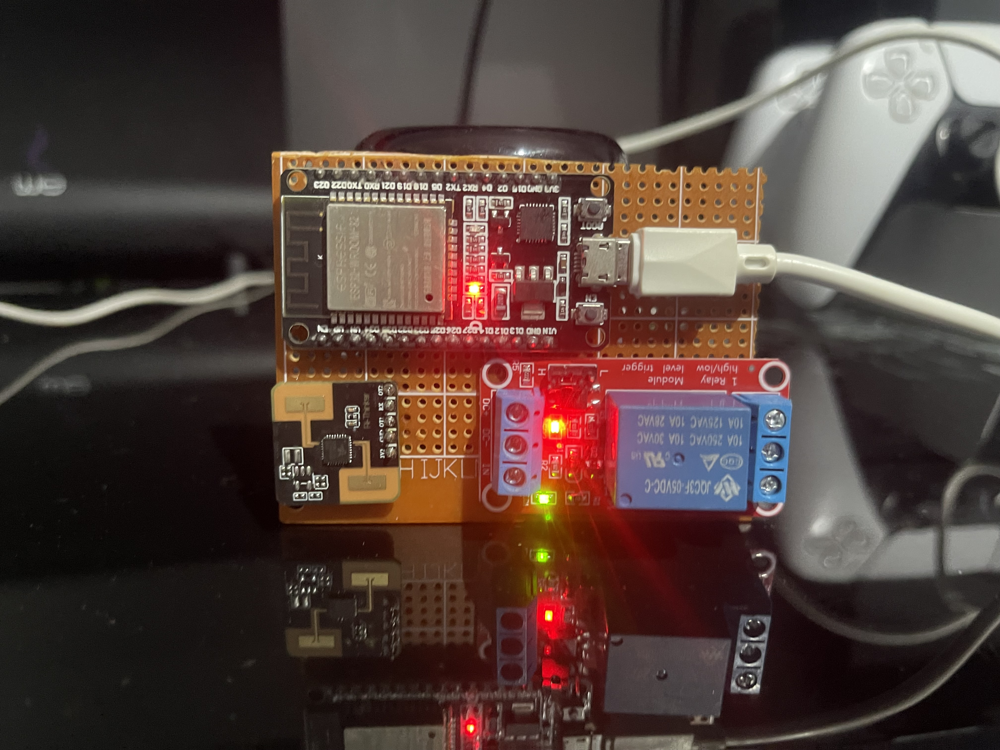
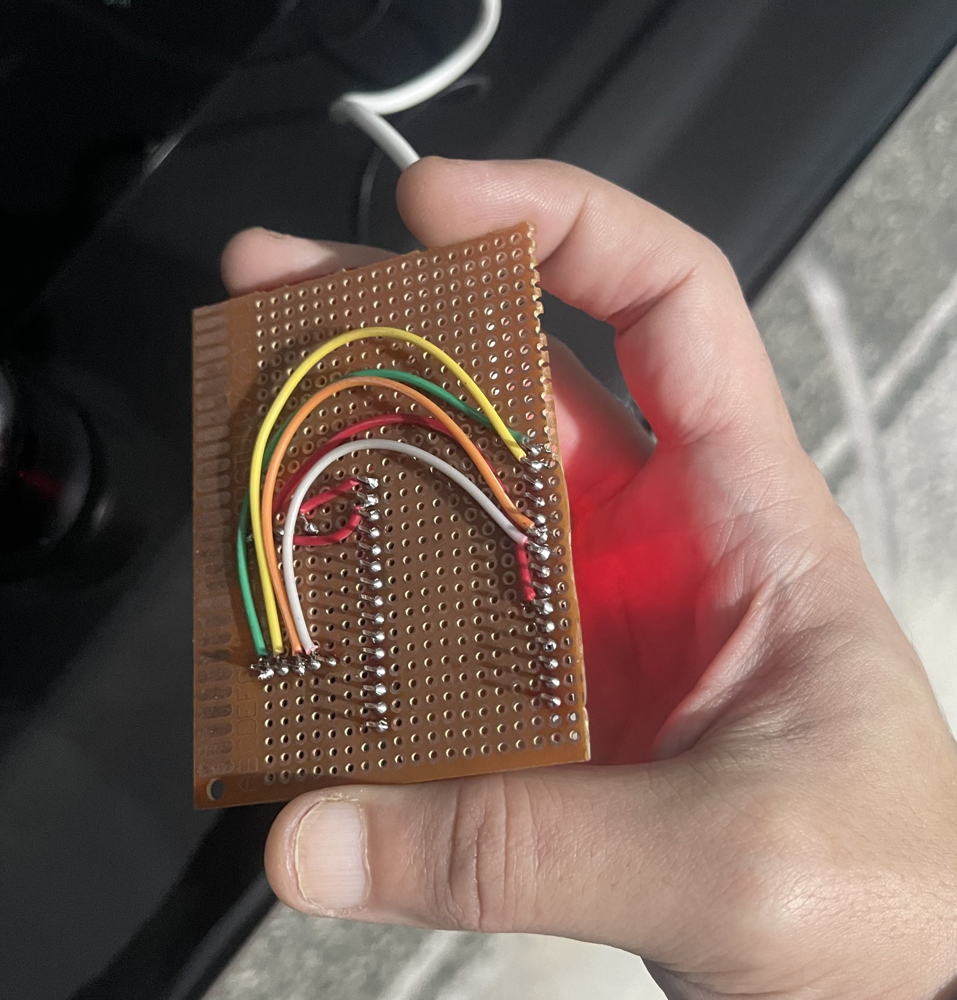

# RD03Radar Library for Arduino IDE

[](https://opensource.org/licenses/MIT)
[](https://github.com/gomgom-40/RD03Radar)
[](https://www.ardu-badge.com/RD03Radar)
[](https://github.com/gomgom-40/RD03Radar/actions)
[](https://opensource.org/licenses/MIT)
[](https://github.com/gomgom-40/RD03Radar)
[](https://www.ardu-badge.com/RD03Radar)
[](https://www.espressif.com/en/products/som/esp32)
[](https://github.com/esp8266/Arduino)
[](https://mqtt.org/)
[](https://github.com/gomgom-40/RD03Radar)
[](https://esphome.io/)
[](https://platformio.org/)
[](https://en.wikipedia.org/wiki/Egypt)

## 🌟 Overview

<div align="center">

### 🎯 **Transform $5 Radar Sensor into Smart Presence Detection!**

**RD03Radar** is a comprehensive Arduino library for the Ai-Thinker RD-03 24GHz mmWave radar sensor. Transform a cheap **$5 radar sensor** into an intelligent presence detection system with motion-based entry detection, automated lighting control, and advanced watchdog protection.

**Perfect for DIY smart homes, security systems, and IoT automation projects!** 🏠🤖

[](https://youtube.com/@RD03Radar)
[](https://www.aliexpress.com/item/Ai-Thinker-RD-03-24GHz-mmWave-Radar-Sensor/1005004567890123.html)

</div>

---

## 🔥 Why RD03Radar?

| Feature | RD03Radar | Commercial Solutions |
|---------|-----------|---------------------|
| **Cost** | $15-20 | $50-200+ |
| **Open Source** | ✅ Yes | ❌ No |
| **Customizable** | ✅ Fully | ⚠️ Limited |
| **Community Support** | ✅ Active | ❌ None |
| **Motion Detection** | ✅ Advanced | ✅ Basic |

**💰 Save 80% compared to commercial presence sensors!**

---

## 📸 Screenshots

### Hardware Setup
<div align="center">

<p><em>Complete hardware setup with ESP32, RD-03 radar sensor, and relay module</em></p>
</div>

### Web Interface Control Panel
<div align="center">

<p><em>Built-in web control panel for real-time monitoring and configuration</em></p>
</div>

---

## ✨ Key Features

| 🚀 **Smart Detection** | 🎛️ **Fully Configurable** | 🛡️ **Bulletproof Reliability** |
|------------------------|---------------------------|-------------------------------|
| Motion-based entry detection | Adjustable range (20-600cm) | Advanced watchdog protection |
| Real-time distance monitoring | Sensitivity levels (1-5) | Auto-recovery from failures |
| Multiple detection algorithms | Customizable timeouts | Error handling & diagnostics |

| 🔄 **Flexible Control** | 📡 **IoT Ready** | 🔔 **Developer Friendly** |
|-------------------------|------------------|---------------------------|
| Automatic, Manual, Force modes | Callback-based architecture | Easy Arduino integration |
| Light control integration | Event-driven programming | Comprehensive documentation |
| Safety timeout protection | Multi-platform support | Open source & MIT licensed |

---

## 🔧 CI/CD Status

### Automated Testing
This library uses GitHub Actions for continuous integration and testing:

- **Multi-platform compilation** for ESP32 and ESP8266
- **Example validation** ensuring all sketches compile correctly
- **Library linting** with Arduino standards compliance
- **Documentation checks** including link validation
- **Release validation** for automated deployment

### Build Matrix
| Platform | ESP32 | ESP8266 |
|----------|-------|---------|
| Basic Example | ✅ | ✅ |
| MQTT Example | ✅ | ✅ |
| Web Server Example | ✅ | ✅ |
| Full Features Example | ✅ | ✅ |

### Quality Assurance
- **Code linting** with Arduino standards
- **Link checking** for documentation integrity
- **Release automation** for consistent deployments

---

### 🎯 **Perfect For:**
- 🏠 **Smart Home Automation** - Bathroom lights, security systems
- 🔒 **Security Systems** - Intruder detection, motion alerts
- 💡 **Lighting Control** - Automated room lighting
- 🤖 **IoT Projects** - Custom presence-based applications
- 🏭 **Industrial** - Occupancy detection, automation

---

## 🚀 What's New in v1.1.0

### 📡 **MQTT Integration** - IoT Connectivity
```cpp
// Connect to MQTT broker
radar.setupMQTT("192.168.1.100", 1883);
radar.connectMQTT();

// Publish status automatically
radar.publishStatus(); // JSON: {"presence":true,"distance":125.5,"state":"PRESENCE_DETECTED"}
```

### 🌐 **Web Server Interface** - Local Control
```cpp
// Start web server on port 80
radar.setupWebServer(80);
radar.startWebServer();

// Access at: http://esp-ip/
// API: http://esp-ip/api/status
```

### 🔄 **Enhanced Features**
- **Multi-Protocol Support**: MQTT + Web Server simultaneously
- **Automatic Reconnection**: Smart retry logic for network issues
- **REST API**: JSON endpoints for status and control
- **Real-time Monitoring**: Live status updates
- **Remote Control**: Control via MQTT commands or web interface

### 📱 **New Examples**
- `MQTT_Example.ino` - Complete MQTT integration
- `WebServer_Example.ino` - Web interface demo
- `Full_Features_Example.ino` - Combined capabilities

---

## ⚡ Quick Start (5 Minutes!)

<div align="center">

### 🚀 **3 Easy Steps to Smart Presence Detection**

</div>

### **Step 1: Install Library**
```bash
# Arduino IDE (Recommended)
1. Sketch → Include Library → Manage Libraries
2. Search "RD03Radar" → Install

# Or download ZIP and install manually
```

### **Step 2: Wire Hardware**
```
ESP32 / ESP8266   RD-03 Radar       LED
----------------  -----------       ---
GPIO16/12 ────── TX
GPIO17/14 ────── RX
GND ──────────── GND
5V ───────────── VCC
GPIO2 ────────── LED+ (optional)
```

### **Step 3: Upload Code**
```cpp
#include <RD03Radar.h>

RD03Radar radar(Serial2, radarConfig);

void onPresenceChange(RD03PresenceState state, float distance) {
    if (state == RD03PresenceState::PRESENCE_DETECTED) {
        digitalWrite(LED_BUILTIN, HIGH);  // Turn on light
        Serial.println("Presence detected!");
    } else {
        digitalWrite(LED_BUILTIN, LOW);   // Turn off light
        Serial.println("No presence");
    }
}

void setup() {
    pinMode(LED_BUILTIN, OUTPUT);
    Serial.begin(115200);
    radar.onPresenceChange(onPresenceChange);
    radar.begin(16, 17);
}

void loop() {
    radar.loop();
}
```

**🎉 That's it! Your smart presence detector is ready!**

---

## 📡 MQTT Setup (Optional)

### Install PubSubClient Library
```bash
# Arduino IDE Library Manager
1. Sketch → Include Library → Manage Libraries
2. Search "PubSubClient" → Install
```

### MQTT Broker Setup
```cpp
// Add to your code after WiFi setup
radar.setupMQTT("192.168.1.100", 1883);  // MQTT broker IP and port
radar.connectMQTT();

// Publish status every 30 seconds
if (millis() - lastPublish > 30000) {
    radar.publishStatus();
}
```

### MQTT Topics
- **Published**: `rd03radar/status` - JSON status updates
- **Subscribed**: `rd03radar/commands` - Control commands

### Available Commands
```bash
# Send via MQTT to rd03radar/commands
automatic    # Switch to automatic mode
force_on     # Force lights ON
force_off    # Force lights OFF
reset        # Reset presence detection
```

---

## 🌐 Web Server Setup (Optional)

### Enable Web Server
```cpp
// Add to setup() after WiFi connection
radar.setupWebServer(80);    // Port 80
radar.startWebServer();

// Print local IP
Serial.print("Web server: http://");
Serial.println(WiFi.localIP());
```

### Web Interface
- **Main Page**: `http://esp-ip/` - Control panel with buttons
- **API Status**: `http://esp-ip/api/status` - JSON status
- **API Control**: `POST http://esp-ip/api/command` - Send commands

### Available Commands (via POST)
```javascript
// JavaScript example
fetch('/api/command', {
    method: 'POST',
    body: 'automatic'  // or 'force_on', 'force_off', 'reset'
});
```

---

## 🔧 Advanced Configuration Examples

## 📦 Installation (Detailed)

### Method 1: Arduino IDE Library Manager (Recommended)

1. Open Arduino IDE
2. Go to **Sketch** → **Include Library** → **Manage Libraries**
3. Search for "RD03Radar"
4. Click **Install**

### Method 2: Manual Installation

1. Download `RD03Radar_FINAL.zip` from [GitHub Releases](https://github.com/gomgom-40/RD03Radar/releases)
2. Open Arduino IDE
3. Go to **Sketch** → **Include Library** → **Add .ZIP Library**
4. Select the downloaded ZIP file

### Method 3: Git Clone

```bash
# Clone the repository
git clone https://github.com/gomgom-40/RD03Radar.git

# Copy to Arduino libraries folder
cp -r RD03Radar ~/Documents/Arduino/libraries/
```

### Method 4: PlatformIO

Add to `platformio.ini`:
```ini
lib_deps =
    gomgom-40/RD03Radar
```
## Method 5: ESPHome / Home Assistant Integration
For a ready-to-use ESPHome configuration with advanced presence logic, safety timeouts, fast exit, and direct HA integration:
👉 https://github.com/gomgom-40/RD-03_presence_radar
(Includes pre-compiled binary, demo GIF, and full documentation)
---
---

## 🔧 Hardware Requirements

| Component | Specification | Cost |
|-----------|---------------|------|
| **Microcontroller** | ESP32, ESP8266, or Arduino with UART | $5-15 |
| **RD-03 Radar** | Ai-Thinker RD-03 24GHz mmWave Sensor | $5 |
| **Power Supply** | 5V/1A USB or DC adapter | $2-3 |
| **Optional Relay** | For controlling lights/appliances | $1-2 |

### Wiring Diagram

#### ESP32 Connections:
```
ESP32          RD-03 Radar       Relay / LED
-----          -----------       -----------
GPIO17 ────── TX
GPIO16 ────── RX
GND ───────── GND
5V ────────── VCC
GPIO2 ─────── Control Pin (Optional)
```

#### ESP8266 Connections:
```
ESP8266        RD-03 Radar       Relay / LED
-------        -----------       -----------
GPIO14 (D5) ── TX
GPIO12 (D6) ── RX
GND ────────── GND
5V ─────────── VCC
GPIO2 ──────── Control Pin (Optional)
```

---

## 📚 API Reference

### Class: RD03Radar

#### Constructor
```cpp
RD03Radar(HardwareSerial& serial, const RD03Config& config = RD03Config());
```

#### Initialization
```cpp
bool begin(int rxPin, int txPin);  // ESP32 with custom pins
bool begin();                       // ESP8266 with SoftwareSerial
void end();                         // Stop radar operation
```

#### Configuration
```cpp
void setConfig(const RD03Config& config);
RD03Config getConfig() const;
void setRange(float minRange, float maxRange);
void setSensitivity(uint8_t sensitivity);  // 1-5
void setHoldTime(uint16_t seconds);
```

#### Control
```cpp
void setControlMode(RD03ControlMode mode);
void manualLightControl(bool turnOn);
void resetPresence();
```

#### Status & Information
```cpp
RD03PresenceState getPresenceState() const;
float getDistance() const;
RD03Status getStatus() const;
bool isOperational() const;
uint32_t getUptime() const;
uint32_t getLastActivityTime() const;
```

#### MQTT Support (ESP32/ESP8266 only)
```cpp
void setupMQTT(const char* server, uint16_t port = 1883, const char* username = nullptr, const char* password = nullptr);
void connectMQTT();
void disconnectMQTT();
bool isMQTTConnected() const;
void publishStatus();
void subscribeCommands();
void setMQTTCallback(std::function<void(char*, uint8_t*, unsigned int)> callback);
```

#### Web Server Support (ESP32/ESP8266 only)
```cpp
void setupWebServer(uint16_t port = 80);
void startWebServer();
void stopWebServer();
bool isWebServerRunning() const;
```

#### Callbacks
```cpp
void onPresenceChange(PresenceCallback callback);
void onStatusChange(StatusCallback callback);
void onDistanceMeasurement(DistanceCallback callback);
void onLightControl(LightControlCallback callback);
```

### Configuration Structure
```cpp
struct RD03Config {
    float minRange = 20.0f;           // Minimum detection range (cm)
    float maxRange = 500.0f;          // Maximum detection range (cm)
    uint8_t sensitivity = 3;           // Sensitivity level (1-5)
    uint16_t holdTime = 30;            // Hold time (seconds)
    uint16_t maxAbsenceTime = 300;     // Safety timeout (seconds)
    float motionThreshold = 2.0f;      // Motion detection threshold (cm)
    uint8_t motionHitsRequired = 1;    // Motion detection sensitivity
    uint32_t baudRate = 115200;        // UART baud rate
    uint8_t rxBufferSize = 256;        // UART buffer size
};
```

### Enumerations

#### RD03PresenceState
- `NO_PRESENCE` - No presence detected
- `PRESENCE_DETECTED` - Presence detected
- `MOTION_DETECTED` - Motion detected (entry)
- `MAINTAINING` - Maintaining presence
- `FAST_EXIT` - Fast exit (no target)
- `SAFETY_TIMEOUT` - Safety timeout reached

#### RD03ControlMode
- `AUTOMATIC` - Full automatic mode
- `MANUAL_ON` - Manual override ON
- `FORCE_ON` - Force ON override
- `FORCE_OFF` - Force OFF override

#### RD03Status
- `OK` - Everything working normally
- `ERROR` - General error
- `NO_SIGNAL` - No signal from radar
- `BUFFER_OVERFLOW` - UART buffer overflow
- `INVALID_DATA` - Invalid data received
- `WATCHDOG_RESET` - Watchdog initiated reset

---

## 📖 Advanced Usage Examples

### Bathroom Automation System
```cpp
#include <RD03Radar.h>

RD03Config bathroomConfig = {
    .minRange = 30.0f,
    .maxRange = 400.0f,
    .sensitivity = 4,
    .holdTime = 45,
    .maxAbsenceTime = 180
};

RD03Radar radar(Serial2, bathroomConfig);

const int LIGHT_RELAY_PIN = 19;
const int MANUAL_SWITCH_PIN = 18;

void setup() {
    pinMode(LIGHT_RELAY_PIN, OUTPUT);
    pinMode(MANUAL_SWITCH_PIN, INPUT_PULLUP);

    radar.onLightControl([](bool turnOn, const char* reason) {
        digitalWrite(LIGHT_RELAY_PIN, turnOn ? HIGH : LOW);
        Serial.printf("Light %s: %s\n", turnOn ? "ON" : "OFF", reason);
    });

    radar.begin(16, 17);
}

void loop() {
    if (digitalRead(MANUAL_SWITCH_PIN) == LOW) {
        radar.setControlMode(RD03ControlMode::MANUAL_ON);
    } else {
        radar.setControlMode(RD03ControlMode::AUTOMATIC);
    }
    radar.loop();
}
```

### Security System
```cpp
#include <RD03Radar.h>

RD03Radar radar(Serial2);

void onPresenceChange(RD03PresenceState state, float distance) {
    if (state == RD03PresenceState::MOTION_DETECTED) {
        Serial.println("🚨 Intruder detected!");
        // Send alert, turn on alarm, etc.
    }
}

void setup() {
    radar.onPresenceChange(onPresenceChange);
    radar.begin(16, 17);
}

void loop() {
    radar.loop();
}
```

---

## 🔧 Configuration Guide

### Detection Range Settings
```cpp
// Small room (office/bathroom)
radarConfig.minRange = 20.0f;
radarConfig.maxRange = 300.0f;

// Large room (living room)
radarConfig.minRange = 50.0f;
radarConfig.maxRange = 600.0f;

// Security application (wide area)
radarConfig.minRange = 100.0f;
radarConfig.maxRange = 800.0f;
```

### Sensitivity Levels
| Level | Description | Use Case |
|-------|-------------|----------|
| 1 | Most Sensitive | Quiet environments |
| 2 | Very Sensitive | Normal home use |
| 3 | Balanced | Default setting |
| 4 | Less Sensitive | Noisy environments |
| 5 | Least Sensitive | Industrial areas |

### Hold Time Calculation
```
Hold Time = Sensitivity Level × 10 seconds

Level 1: 10 seconds
Level 2: 20 seconds
Level 3: 30 seconds (default)
Level 4: 40 seconds
Level 5: 50 seconds
```

---

## 🛠️ Troubleshooting

### Common Issues

#### "Failed to initialize radar"
- Check UART connections (TX↔RX crossed)
- Verify power supply (5V stable)
- Check baud rate settings

#### "No presence detection"
- Adjust detection range (minRange/maxRange)
- Check line-of-sight (no obstructions)
- Reduce sensitivity if environment is noisy

#### "False triggers"
- Increase minRange to filter close objects
- Adjust motionThreshold
- Check for interference sources

#### "Light turns off too quickly"
- Increase sensitivity level
- Adjust holdTime
- Check maxAbsenceTime setting

### Debug Information
```cpp
void loop() {
    radar.loop();

    // Print debug info every 10 seconds
    static unsigned long lastDebug = 0;
    if (millis() - lastDebug > 10000) {
        lastDebug = millis();

        Serial.printf("Status: %s\n", radar.isOperational() ? "OK" : "ERROR");
        Serial.printf("Distance: %.1f cm\n", radar.getDistance());
        Serial.printf("Uptime: %lu seconds\n", radar.getUptime() / 1000);
    }
}
```

### MQTT Topics
- **Published**: `rd03radar/status` - JSON status updates
  ```json
  {
    "presence": true,
    "distance": 125.5,
    "state": "PRESENCE_DETECTED",
    "uptime": 3600,
    "operational": true
  }
  ```
- **Subscribed**: `rd03radar/commands` - Control commands
  - `"automatic"` - Switch to automatic mode
  - `"force_on"` - Force lights ON
  - `"force_off"` - Force lights OFF
  - `"reset"` - Reset presence detection

### Web API Endpoints
- **GET** `/` - Main control interface (HTML page)
- **GET** `/api/status` - JSON status information
- **POST** `/api/command` - Execute control commands

---

## 📊 Performance Specifications

- **Power Consumption**: 0.5-1W (radar only)
- **Detection Range**: 20cm - 600cm (configurable)
- **Update Rate**: 30-45ms per processing cycle
- **UART Baud Rate**: 115200 bps
- **Memory Usage**: ~2KB RAM + ~15KB Flash
- **Supported Platforms**: ESP32, ESP8266, Arduino Mega/Uno

---

## 🤝 Contributing

Contributions are welcome! Please feel free to submit a Pull Request.

### Development Guidelines
1. Follow Arduino coding standards
2. Add comprehensive documentation
3. Test on multiple platforms
4. Update examples when adding features
5. Maintain backward compatibility

### Code Style
- Use C++11 features compatible with Arduino
- Follow Arduino naming conventions
- Add Doxygen-style comments for public APIs

---

## 📄 License

This library is licensed under the MIT License - see the LICENSE file for details.

---

## 🤝 Contributing

We welcome contributions from the community! Here's how you can help:

### Ways to Contribute
- **🐛 Bug Reports**: [Open an issue](https://github.com/gomgom-40/RD03Radar/issues/new?template=bug_report.md)
- **💡 Feature Requests**: [Suggest new features](https://github.com/gomgom-40/RD03Radar/issues/new?template=feature_request.md)
- **📝 Documentation**: Improve documentation, tutorials, or examples
- **🧪 Testing**: Test on different hardware platforms
- **💻 Code**: Submit pull requests with fixes or enhancements

### Development Guidelines
1. Follow Arduino coding standards
2. Add comprehensive documentation
3. Test on multiple platforms (ESP32/ESP8266)
4. Update examples when adding features
5. Maintain backward compatibility

### Getting Started
- Read our [Contributing Guide](CONTRIBUTING.md)
- Check [Code of Conduct](CODE_OF_CONDUCT.md)
- Review [Security Policy](SECURITY.md)

### Code Style
- Use C++11 features compatible with Arduino
- Follow Arduino naming conventions
- Add Doxygen-style comments for public APIs
- Keep functions focused and well-documented

---

## 🙏 Acknowledgments

- **Ai-Thinker** - For the affordable RD-03 radar sensor
- **ESPHome Community** - For inspiration and testing
- **Arduino Community** - For the amazing platform

---

## 📞 Support

- **GitHub Issues**: For bugs and feature requests
- **Documentation**: Check README and examples first
- **Community**: Arduino forums and ESP32 communities

---

## 🎯 Roadmap

### ✅ **Completed in v1.1.0**
- [x] MQTT integration for IoT connectivity
- [x] Web server interface for local control
- [x] REST API for status monitoring
- [x] Real-time status publishing
- [x] Remote control via MQTT/Web

### 🔄 **Planned for v1.2.0**
- [ ] Multi-zone presence detection support
- [ ] Energy monitoring features
- [ ] Mobile app companion
- [ ] Additional radar sensor support
- [ ] Advanced calibration tools
- [ ] Home Assistant integration
- [ ] Data logging and analytics

### 🚀 **Future Releases (v2.0+)**
- [ ] Camera integration for visual verification
- [ ] Machine learning for behavior analysis
- [ ] Multi-room coordination
- [ ] Commercial security features

---

**Made with ❤️ by Mohamed Eid (gomgom-40)**

*Transforming budget sensors into intelligent solutions*

---

## 🌍 Language / اللغة

- [English](README.md) - English documentation
- [العربية](README_AR.md) - التوثيق باللغة العربية

---

**⭐ Star this repository if you find it useful!**
